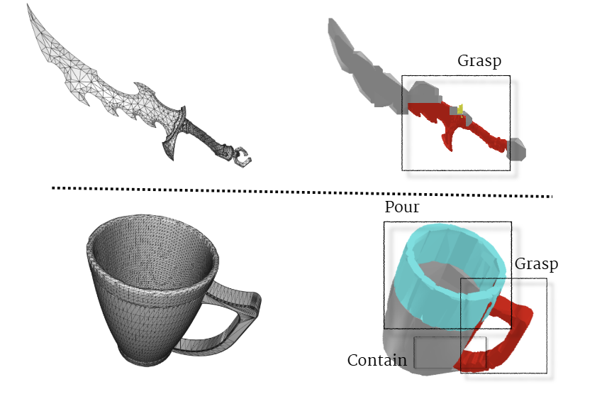

# Interaction-Aware Convex Decomposition

**Affordance-Guided Automation for 3D Object Convex Decomposition**
사용자 인터랙션을 고려한 어포던스 기반 3D 객체 볼록 분해 자동화


---

## 1. 프로젝트 개요

본 프로젝트는 3D 객체의 **어포던스(Affordance)** 정보를 활용하여 사용자 인터랙션에 중요한 영역을 자동으로 탐지하고, 해당 영역에 더 정밀한 Empart Convex Decomposition을 적용하는 파이프라인을 구현한 프로젝트이다.

파이프라인은 해당 Affordance 추론 및 granularity 추정 모듈과 Empart ACD 모듈 ( [Software_Capstone_Empart](https://github.com/Ggulbogpig/Software_Capstone_Empart) )이 병렬적으로 동작하여 최종 병합되는 구조이다. 

기존 Approximate Convex Decomposition(ACD)은 주로 객체의 기하학적 특성만을 기준으로 전체 메시를 동일한 기준으로 분해한다. 이 방식은 단순하고 일반적이지만, 실제 게임이나 시뮬레이션 환경에서 사용자가 상호작용하는 영역과 그렇지 않은 영역을 구분하지 못한다.

예를 들어 머그컵의 손잡이, 가방의 핸들, 전자레인지의 문 손잡이, 칼의 손잡이처럼 사용자가 직접 잡거나 조작하는 영역은 더 정밀한 충돌 표현이 필요하다. 반면 사용자 상호작용이 적은 영역은 상대적으로 단순하게 분해해도 전체 인터랙션 품질에 큰 영향을 주지 않는다.

본 프로젝트는 이러한 문제를 해결하기 위해 다음 과정을 수행한다.

1. 3D 메시를 포인트 클라우드로 변환
2. 3D-AffordanceLLM 기반 포인트 단위 affordance 추론
3. KD-Tree 기반 Point-to-Mesh 매핑
4. Face-level affordance table 생성
5. Affordance 기반 주요 영역 Bounding Box 생성
6. LLM 기반 영역별 ACD granularity 산출
7. Empart ACD / V-HACD 기반 영역별 Adaptive Convex Decomposition 수행

---

## 2. 핵심 아이디어

본 프로젝트의 핵심은 **3D 객체를 전체적으로 동일하게 분해하지 않고, 사용자 상호작용에 중요한 영역을 중심으로 차등 분해하는 것**이다.

기존 ACD는 전체 mesh에 대해 하나의 threshold 또는 하나의 decomposition setting을 적용한다. 하지만 본 프로젝트에서는 affordance 정보를 활용하여 객체 내에서 실제 상호작용이 발생할 가능성이 높은 영역을 탐지하고, 해당 영역에 더 많은 convex hull과 더 낮은 threshold를 적용한다.

반대로 상호작용 중요도가 낮은 영역은 적은 hull 수와 더 높은 threshold를 적용하여 계산 비용을 줄인다.

---

## 3. 전체 파이프라인

```text
3D Mesh (.obj / .glb)
        ↓
Point Cloud Sampling
        ↓
3D-AffordanceLLM Inference
        ↓
Point-level Affordance Result
        ↓
KD-Tree Point-to-Mesh Mapping
        ↓
Face-level Affordance Table
        ↓
Bounding Box Region Generation
        ↓
LLM-based Granularity Assignment
        ↓
Adaptive Convex Decomposition
        ↓
Final Convex Parts / Visualization
```

---

## 4. 개발 환경

본 프로젝트는 다음 환경에서 실험하였다.

```text
OS: Windows 11 / WSL2 Ubuntu
Python: 3.10, 3.11
CUDA: 11.8
PyTorch: 2.0
Base Model: 3D-AffordanceLLM / OpenAD 기반 모델
ACD Tool: Empart ACD
Decomposition Engine: V-HACD / CoACD 실험
Libraries: NumPy, Pandas, Trimesh, Open3D, Scipy, scikit-learn
```

---

## 5. 주요 폴더 및 파일 구조

현재 레포지토리는 실험 과정에서 사용한 ADLLM 기반 코드와 affordance-to-ACD 파이프라인 코드가 함께 포함되어 있다.

```text
.
├── app_LLM.py
├── inference.py
├── trainer.py
├── requirements.txt
│
├── configs/
│   ├── models/
│   │   └── point_phi.yaml
│   └── phi_train/
│       └── phi_train.yaml
│
├── models/
│   └── aff_phi.py
│
├── evaluators/
│   └── affordance_eval.py
│
├── BPA.py
├── KDTree.py
├── bbox.py
├── granularity.py
├── merge2mesh.py
├── pipeline_local.py
├── voting.py
│
├── visualize.py
├── visualize_ply.py
├── visualize_gt.py
├── visualize_local.py
├── visualize_prop.py
│
├── object/
├── dataset/
├── rule/
├── mask_outputs/
│
└── README.md
```

### 주요 파일 설명

| 파일명                                 | 설명                                                          |
| ----------------------------------- | ----------------------------------------------------------- |
| `inference.py`                      | 3D-AffordanceLLM 기반 affordance inference 실행                 |
| `KDTree.py`                         | point-level affordance를 mesh face에 매핑하기 위한 KD-Tree 기반 매핑 코드 |
| `bbox.py`                           | affordance region 기반 bounding box 생성                        |
| `granularity.py`                    | LLM을 활용하여 affordance region별 ACD granularity 산출             |
| `pipeline_local.py`                 | 로컬 환경에서 전체 affordance-to-region pipeline을 실행하기 위한 스크립트      |
| `merge2mesh.py`                     | affordance 결과를 mesh 또는 시각화 가능한 형태로 변환                       |
| `visualize.py` / `visualize_ply.py` | point cloud, affordance, decomposition 결과 시각화               |
| `voting.py`                         | point 또는 face 단위 affordance 결과 후처리 및 voting                 |
| `BPA.py`                            | Ball Pivoting Algorithm 기반 mesh reconstruction 실험           |
| `requirements.txt`                  | Python dependency 목록                                        |

---

## 6. 실행 방법
## Pipeline 사용 방법

본 저장소는 3D 메시 파일을 포인트 클라우드로 변환한 뒤, affordance를 추론하고, 추론 결과를 기반으로 EmpartACD를 실행하여 interaction-aware convex decomposition 결과를 생성하는 파이프라인을 제공합니다.

### 6.1 3D 메시 파일 준비

먼저 `.obj` 또는 `.glb` 형식의 원하는 메시 파일을 다운로드하거나 준비합니다.

준비한 메시 파일은 `object/` 폴더에 저장합니다.

예시:

```bash id="9oalcu"
object/object.glb
```

---

### 6.2 메시 파일을 포인트 클라우드로 변환

`visualize_ply.py` 파일에서 입력 메시 파일명과 출력 포인트 클라우드 파일명을 수정하거나, 아래 명령어를 실행합니다.

```bash id="8cc7fb"
python visualize_ply.py ^
--mesh object/object.glb ^
--output object/object_point.ply ^
--points 2048 ^
--method poisson
```

이 과정에서는 입력 메시 파일을 포인트 클라우드 파일로 변환하며, 변환된 결과는 `object/` 폴더에 저장됩니다.

출력 예시:

```bash id="1nwl8g"
object/object_point.ply
```

---

### 6.3 Affordance 추론 실행

`inference.py` 파일에서 affordance를 추론할 포인트 클라우드 파일 경로를 수정합니다.

입력 예시:

```bash id="bqu4sm"
object/object_point.ply
```

이후 다음 명령어로 affordance 추론을 실행합니다.

```bash id="cxlqk4"
python inference.py
```

실행이 완료되면 다음과 같은 결과 파일이 생성됩니다.

```bash id="lsb87j"
table18196_point_affordance_colored.ply
storage39441_point_affordance.csv
```

각 파일의 의미는 다음과 같습니다.

```bash id="z03fi1"
*_point_affordance_colored.ply   # affordance 예측 결과가 색상으로 표시된 포인트 클라우드 파일
*_point_affordance.csv           # 각 포인트별 affordance 예측 결과가 저장된 CSV 파일
```

---

### 6.4 EmpartACD 실행 설정

`run_empart.sh` 파일에서 실행할 object 파일, affordance CSV 파일, 출력 파일명을 수정합니다.

또한 `pipeline_local.py` 파일에서도 사용할 파일명과 경로를 대상 object에 맞게 수정합니다.

설정이 완료되면 다음 명령어로 전체 파이프라인을 실행합니다.

```bash id="ztyk61"
python pipeline_local.py
```

---

### 6.5 최종 결과 확인 및 시각화

실행이 완료되면 `empart/outputs/` 폴더에 최종 결과 JSON 파일이 생성됩니다.

출력 예시:

```bash id="lgd7ox"
empart/outputs/total_result_object.json
```

해당 JSON 파일에는 affordance 추론 결과를 반영한 interaction-aware convex decomposition 결과가 저장됩니다.

` visualize_CLI.py ` 파일에서 경로 수정 후 실행 시 ACD 진행 결과를 확인할 수 있습니다. 


### 7 환경 설정

먼저 필요한 패키지를 설치한다.

```bash
pip install -r requirements.txt
```

CUDA 및 PyTorch 버전은 실험 환경에 맞게 별도로 맞춰야 한다. 본 프로젝트에서는 CUDA 11.8 및 PyTorch 2.0 환경에서 실험하였다.

---

### 7.1 Affordance Inference 실행

3D 객체에 대해 point-level affordance를 추론한다.

```bash
python inference.py
```

실행 후 객체별 affordance 결과가 `.csv`, `.ply`, `.glb` 등의 형태로 저장된다.

예시 결과 파일:

```text
mug8555_point_affordance.csv
mug8555_point_affordance_colored.ply
microwave3465_point_affordance.csv
microwave3465_point_affordance_colored.ply
knife5_point_affordance.csv
knife5_point_affordance_colored.ply
```

---

### 7.2 Point-to-Mesh Mapping

포인트 단위 affordance 결과를 원본 mesh의 face 단위 정보로 변환한다.

```bash
python KDTree.py
```

이 과정에서는 KD-Tree 기반 최근접 이웃 탐색을 사용하여 point-level affordance를 mesh face에 할당한다.

예시 출력:

```text
face_affordance_table.csv
face_affordance_table_bag.csv
face_affordance_table_headset.csv
mug8555_face_affordance.csv
microwave3465_face_affordance.csv
```

---

### 7.3 Bounding Box 생성

Face-level affordance 정보를 바탕으로 주요 affordance region을 감싸는 bounding box를 생성한다.

```bash
python bbox.py
```

예시 출력:

```text
auto_regions.csv
auto_regions_cup.csv
auto_regions_mug8555.csv
auto_regions_microwave3465.csv
auto_regions_motor.csv
```

Bounding Box는 이후 Empart ACD에 입력될 region 정보로 사용된다.

---

### 7.4 LLM 기반 Granularity 산출

각 affordance region의 중요도를 판단하고, 영역별 ACD granularity를 산출한다.

```bash
python granularity.py
```

이 스크립트는 region별 affordance, object context, game rule 등을 기반으로 LLM에게 영역별 중요도를 판단하도록 요청한다.

출력 예시:

```text
face_affordance_granularity.csv
face_affordance_granularity_cup.csv
face_affordance_granularity_mug8555.csv
face_affordance_granularity_microwave3465.csv
```

> 주의: API Key는 코드에 직접 작성하지 않고 `.env` 또는 환경 변수로 관리해야 한다.

예시:

```bash
set OPENAI_API_KEY=your_api_key
```

또는 Linux/WSL 환경:

```bash
export OPENAI_API_KEY=your_api_key
```

---

### 7.5 Local Pipeline 실행

로컬에서 affordance mapping, bounding box generation, granularity assignment 등을 통합적으로 실행할 경우 다음 스크립트를 사용할 수 있다.

```bash
python pipeline_local.py
```

---

### 7.6 Empart ACD 실행

생성된 region csv를 Empart ACD에 입력하여 영역별 Adaptive Convex Decomposition을 수행한다.

예시 실행 명령어:

```bash
python -m intrinsic.empart decompose 3465.obj 408 \
  --boxes_csv auto_regions_microwave3465.csv \
  --method coacd > total_result_microwave3465.json
```

또는 특정 affordance region만 테스트할 경우:

```bash
python -m intrinsic.empart decompose input.obj 408 \
  --boxes_csv lift_only.csv \
  --method coacd > result.json
```

실험에서는 Web 기반 V-HACD와 CLI 기반 CoACD를 함께 비교하였다. 일부 객체에서는 Web V-HACD가 손잡이와 같은 affordance region을 더 안정적으로 보존하는 결과를 보였다.

---

### 7.7 결과 시각화

Point cloud, affordance region, decomposition 결과를 시각화하기 위해 다음 스크립트를 사용한다.

```bash
python visualize.py
```

또는 PLY 파일을 직접 확인할 경우:

```bash
python visualize_ply.py
```

예시 시각화 파일:

```text
knife5_point_affordance_colored.ply
mug8555_point_affordance_colored.ply
microwave3465_point_affordance_colored.ply
bag8879_point_affordance_colored.ply
```

---

## 8. 실험 대상 객체

본 프로젝트에서는 다양한 affordance와 geometry를 가진 객체를 대상으로 실험하였다.

| 객체 유형                                | 주요 affordance              | 실험 목적                  |
| ------------------------------------ | -------------------------- | ---------------------- |
| Mug                                  | grasp, contain, wrap_grasp | 손잡이 및 내부 공간 보존 확인      |
| Bag                                  | grasp, lift, contain       | 핸들 영역 분해 품질 확인         |
| Microwave                            | openable, contain          | 문 손잡이 및 내부 공간 탐지       |
| Knife                                | grasp, cut, stab           | 얇은 구조와 손잡이 영역 분해 확인    |
| Chair                                | sittable, support          | 앉는 영역 및 지지 영역 탐지       |
| Motor / Gun / Projectile-like object | grasp, contain, lift       | 복잡한 게임 오브젝트에 대한 적용성 확인 |

---

## 9. Acknowledgement

본 프로젝트는 소프트웨어융합캡스톤디자인 과제로 수행되었다.


# 3D-AffordanceLLM: Harnessing Large Language Models for Open-Vocabulary Affordance Detection in 3D Worlds.
Official implementation of 3D-AffordanceLLM: Harnessing Large Language Models for Open-Vocabulary Affordance Detection in 3D Worlds.

# Authors
**Hengshuo Chu**<sup>1</sup>, **Xiang Deng**<sup>1</sup>\*, **Qi Lv**<sup>1</sup>, **Xiaoyang Chen**<sup>1</sup>, **Yinchun Li**<sup>2</sup>, **Jianye Hao**<sup>2</sup>,**Liqiang Nie**<sup>1</sup>\*

1 School of Computer Science and Technology, Harbin Institute of Technology (Shenzhen)

2 Huawei Noah’s Ark Lab

\* Corresponding author

# Getting Started
Training repository of 3D Affordance LLM
## Installation

In order to install the dependencies, you can use the following commands:

```bash
conda create -n 3daff
conda activate 3daff
conda install pytorch==2.0.0 torchvision==0.15.0 torchaudio==2.0.0 pytorch-cuda=11.8 -c pytorch -c nvidia
pip install -r requirements.txt
```

## Running Configuration

The configurations for running are stored in `configs/` directory. It contains four fields, which are
| Field          | Description                        |
| -------------- | ---------------------------------- |
| run            | Training hyperparameters           |
| model          | Model configurations               |
| train_datasets | Training datasets                  |
| eval_datasets  | Evaluation datasets and evaluators |

Explanation for some keys.

- Field `run`

  - `evaluate`: Set to `True` for evaluation only.

- Field `model`

  - Use `arch` and `model_type` to select a specific model.
  - You can also override any corresponding entry in original model configuration file here.

- Field `train_datasets`

  - `type ` indicates the data loader to use

  ```yaml
  train_datasets:
    dataset_name:
      type: affordance
      sample_ratio: 10
  ```

- Field `eval_datasets`

  - `eval_type ` indicates the evaluator to use

  ```yaml
  train_datasets:
    dataset_name:
      type: affordance
      eval_type: affordance_acc
  ```


## General Training Guide for this code

For multi-gpu training, you can use the following command:
```bash
CUDA_VISIBLE_DEVICES=0,1 TOKENIZERS_PARALLELISM=true  torchrun --master_port 11453 --nproc_per_node=2 train.py --cfg-path configs/phi_train/phi_train.yaml
```
For single-gpu training, you can use the following command:
```bash
python train.py --cfg-path configs/phi_train/phi_train.yaml
```
For deepspeed training: Please refer to [HuggingFace Accelerator Document](https://huggingface.co/docs/accelerate/v0.22.0/en/usage_guides/deepspeed) for more details.

Here is an example:

```bash
accelerate launch --config_file ds_config.yaml train.py --cfg-path configs/phi_train/phi_train.yaml
```


## Affordance Model Train
```bash
# deepspeed training
# train for model identify
accelerate launch --config_file ds_config.yaml train.py --cfg-path configs/phi_train/phi_train.yaml > outputs/train.log 2>&1 &

```

## Affordance Model Eval
```bash
# Single GPU Eval
CUDA_VISIBLE_DEVICES=1 python train.py --cfg-path configs/eval/phi_eval.yaml 

# Multi Gpu Eval
CUDA_VISIBLE_DEVICES=0,1 TOKENIZERS_PARALLELISM=true  torchrun --master_port 11453 --nproc_per_node=2 train.py --cfg-path configs/eval/phi_eval.yaml
```

## Adding Custom Models

### Model

You can follow the instructions below to create any custom models.

1. Create new model class in `models/`  directory. Models should inherit from `nn.Model`. 
2. The model should have a **Decorator** `@registry.register_model("model_name")`, which indicates the **model name**.
3. The model should have a **class variable** named `PRETRAINED_MODEL_CONFIG_DICT`, which is a python dictionary, indicating all optional **model type** and their corresponding configuration file paths.
4. The model should contain 2 special method: `load_from_pretrained` for loading pretrained checkpoint (you can just copy from the example below). Class method `from_config` for reading model configuration file.
5. The `forward ` method should return a dictionary containing key `loss`. For inference, you may implement a different method `generate`. 
6. The `forward ` method receives a dictionary provided by data loader.
7. Import your model in `models/__init__.py`

Here is an example for creating new model.

```python
@registry.register_model("linear_vicuna_instruct")
class LinearVicuna(Basemodel):
    PRETRAINED_MODEL_CONFIG_DICT = {
        "vicuna7b": "configs/models/linear_vicuna.yaml",
        ...
    }
    def __init__(
            self,
            param1,
            param2,
            ...,
            **kwargs
    ):
        super().__init__()
        
    def forward(self, samples_dict):
        # ...
        return {"loss": loss}
        
    def load_from_pretrained(self, url_or_filename):
        if os.path.isfile(url_or_filename):
            checkpoint = torch.load(url_or_filename, map_location="cpu")
        else:
            raise RuntimeError("checkpoint url or path is invalid")

        state_dict = checkpoint["model"]
        msg = self.load_state_dict(state_dict, strict=False)
        logging.info("load checkpoint from %s" % url_or_filename)
        return msg
        
    @classmethod
    def from_config(cls, cfg):
        param1 = cfg.get("param1", None)
        param2 = cfg.get("param2", None)

        model = cls(
            param1=param1,
			      param2=param2
        )

        model.load_checkpoint_from_config(cfg)
        return model
```

### Configuration

After creating the model class, you can follow the instructions below to create corresponding configuration file.

1. Key `model` indicates the configuration for model. Any child key under key `model` can be read using `cfg.get()`  in model's `from_config` method.

And here is an example for creating corresponding configuration file.

```yaml
model:
  param1: 123
  param2: 234

```

### Training

Each training configuration file also contains a `model` key. Add two special key under key `model`: 

1. `arch` for **model name** （the name you defined in **decorator**) 
2. `model_type` for different model configuration (the configuration dictionary you defined in ``PRETRAINED_MODEL_CONFIG_DICT``)

You can also override any key in original configuration file here.

```yaml
model:
  arch: comm_vicuna_clip_adapter
  model_type: vicuna7b
  
  load_pretrained: True
  pretrained: "path/to/checkpoint.pth"
  
run:
  ....
```

### Inference
<!-- 3D_ADLLM，我没有定义preprocess -->
For inference, you can use `load_model_and_preprocess` method along with your **model name** and **model type** to load the model. Then just call the implemented `generate` method.

```python
from models import load_model_and_preprocess

model, processor, _ = load_model_and_preprocess(
    name=args.model_name,
    model_type=args.model_arch,
    is_eval=True,
    device="cuda:0",
)
model.load_from_pretrained(args.ckpt)

```

## Adding Custom Data Loader

### Dataloader

You can follow the instructions below to create any custom data loaders.

1. Create new data loader class in `dataset/`  directory. data loader should inherit from `torch.utils.data.Dataset`. 
2. Implement `__len__` method and `__getitem__` method. 

```python
class VQADataset(Dataset):
    def __init__(self):
        self.annotation = read_from_file()

    def __len__(self):
        return len(self.annotation)
        
    def __getitem__(self, index):
        return {
            "image": image,
            "question": question,
            "answer": answers
        }
```

After creating your data loader class, register it in `dataset/builder.py`.

1. Add a **decorator** `@registry.register_builder(dataloader_name) `, which defines its name.
2. Define what datasets can be support by this loader.

```python
@registry.register_builder("vqa") 
def build_vqa_dataset(name):
    cfg_path = "configs/datasets/vqa_datasets.yaml"
    all_cfg = OmegaConf.load(cfg_path)
    cfg = all_cfg.get(name, None)
    assert cfg is not None, f"Dataset {name} not found in {cfg_path}"
    
    dataset = VQADataset(....)
    return dataset
```

Here is an example to use your custom data loader.

```yaml
train_datasets:
  dataset_name:
    type: vqa
```
### Datsets

Datasets configurations are stored in `configs/datasets`. An example of LRV dataset is shown below:
<!-- 这里主要看数据Dataset的定义情况 -->
<!-- 这里如果前面我们有定义相应的processor,那么这里可以设置-->
```yaml
LRV:
  ann_path: "path/to/LRV.json" # path to the annotation json file
  vis_processor: "blip2_image_train" # the name of the visual processor registered in folder `processors`
```
<!-- Else -->
```yaml
3D_Affordance_train:
  ann_path: "/workspace/Dataset/process_data_for_affllm/final_train_data_full_shape_mask.pkl" # path to the data
```
For easy switching between servers, the path in the dataset configuration can be an absolute path or a relative path with the root set in `common/registry.py`. You can set the root by `registry.root = "path/to/root"`.

## Adding Custom Evaluator

You can follow the instructions below to create any custom evaluators.

1. Create new evaluator class in `evaluator`  directory. 
2. Add a **decorator** `@registry.register_evaluator(name) `, which defines its name.
3. Register in `evaluator/__init__.py`.

# Acknowledgement

[LAVIS](https://github.com/salesforce/LAVIS): This repository is modified from LAVIS.
